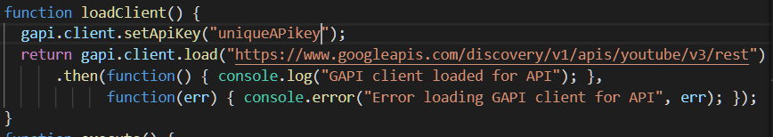
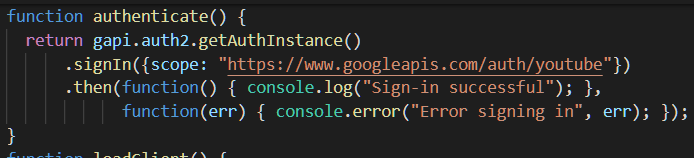
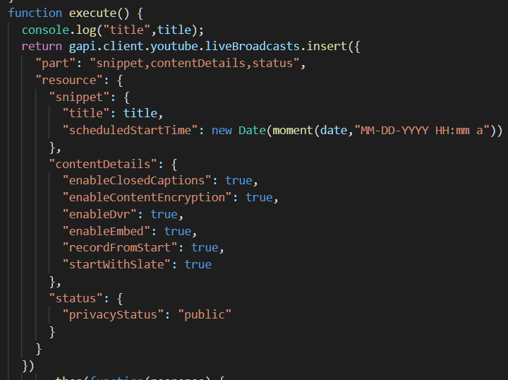
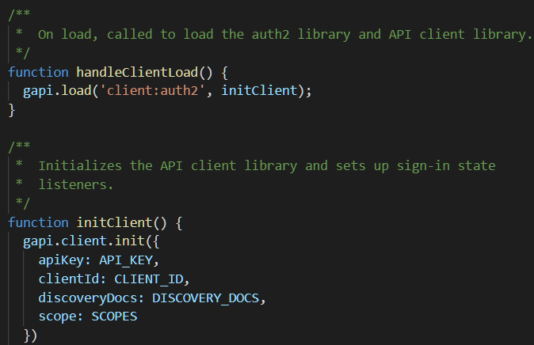
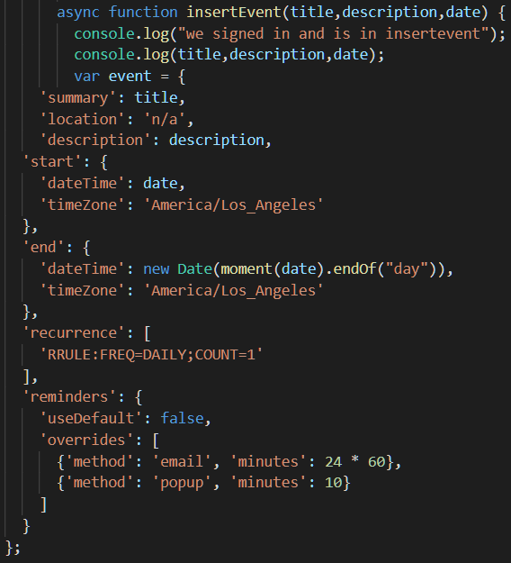
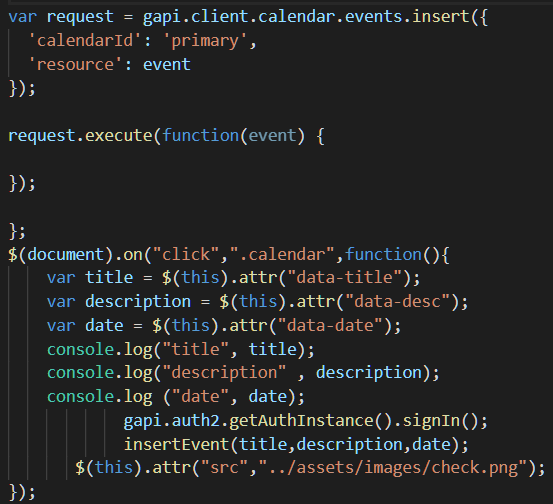
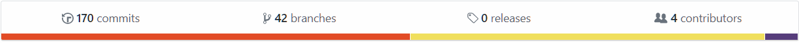
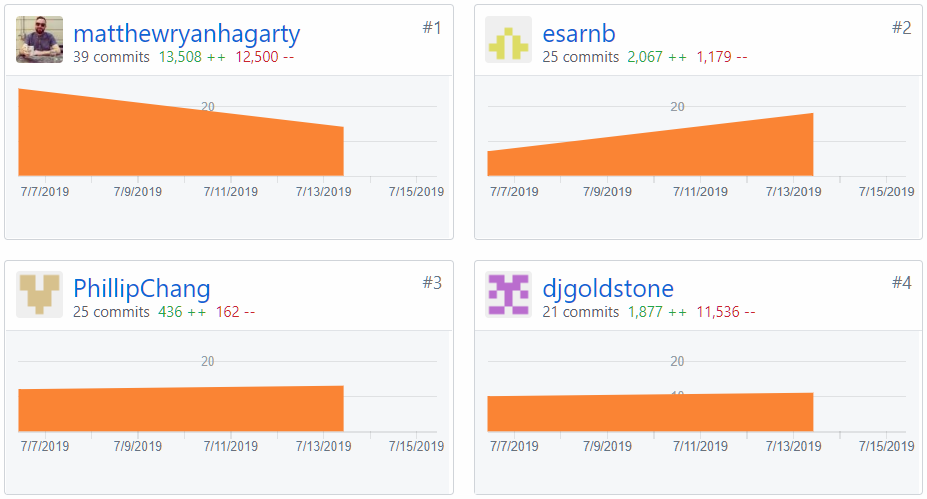
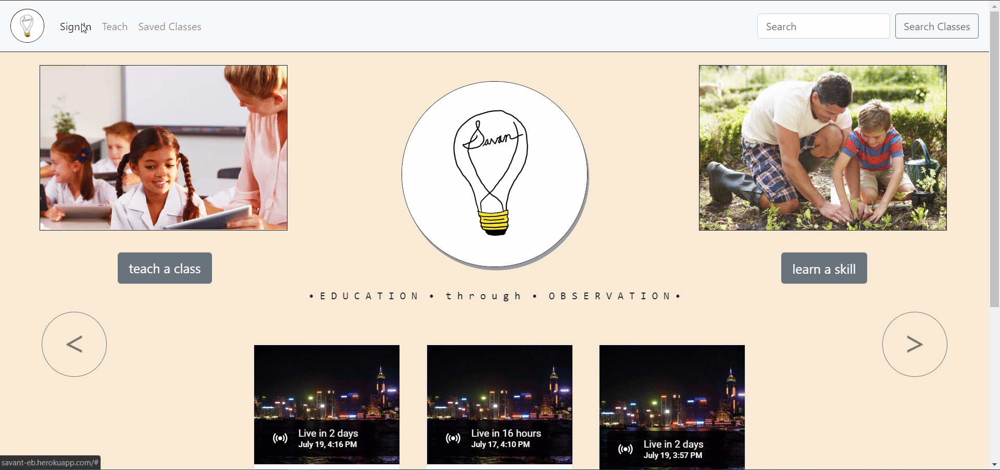
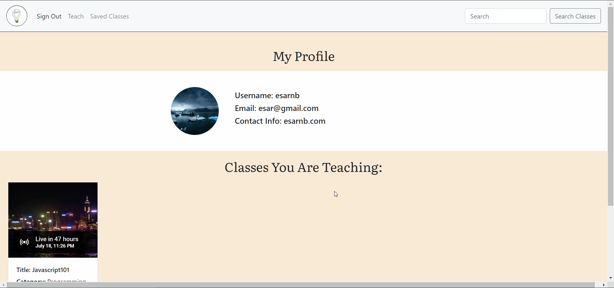

# Savant
#### <i> E D U C A T I O N ~ t h r o u g h ~ O B S E R V A T I O N</i>

<b>[Visit Savant deployed page](https://savant-pc.herokuapp.com/)</b>

Savant is a free user content generated portal for tutorials and online classes. Our motto is "Education through observation". Knowledge is something that should be shared and this platform enables instructors to broadcast their expertise with the world via YouTube livestream.

## Design

#### Configuration

Savant users begin by creating a user profile by entering their username, email, password, contact url, and avatar jpg image file. After account creation a Savant user can opt to teach a class by providing a class title. After a title is given, the instructor then provides a class description, class description via drop-down menu, and schedules a date/time in Google Calendar. Upon sumbit, the YouTube API generates an embed with the livestream url. 

The UI for Savant makes extensive use of Twitter Bootstrap CDN, animate.css, Google Fonts, and Font Awesome to create an engaging UX. Registered classes are displayed within dynamically generated cards within a Bootstrap carousel. Embedded within each class card is YouTube livestream iframe and course information from the YouTube API. The motto tagline and "Teach a Class"/"Learn A Skill" buttons are animated via class names in animate.css for aesthetic effect. Bootstrap's forms and modals provide streamlined structure to collect data values in order to make API calls and populate our sequelize models.

## Logic

### Getting Started

* Software Requirements
    * NodeJS
    * MySQL
    * Firebase
        * Generation of own firebase account and API Keys
    * AWS S3 Buckets
        * Generation of own AWS buckets API keys, bucket name and secret access

<b>*** It is important to keep all API Keys and secret access confidential through the storage of keys in a .env file and securing upload of .env in a .gitignore file.</b>

 * Installing all node packages
    * >Initialize terminal and execute npm i to install all necessary node packages

### Deployment
* After successful installation of npm packages, deployment is done on Heroku for free.
* Be sure to include access keys, api keys and other secrets on Heroku's Config settings.

____
## Code Snippets

* YouTube API   
    * YouTube Live Authentication   
    
     
    
    * Google Authentication w/ YouTube   
    
    
    * Creating a YouTube LiveBroadcast   
    

_______
* Google Calendar API   
    * Google Authorization   
    
    
    * Insert Event Function   
    
    
    * Event Listner to execute insertion of event to user's Google calendar   
    
_____
## Built With
_____

* [HTML](https://developer.mozilla.org/en-US/docs/Web/Guide/HTML/HTML5)
* [CSS](https://developer.mozilla.org/en-US/docs/Web/CSS)
* [JavaScript](https://developer.mozilla.org/en-US/docs/Web/JavaScript/Reference)
* [Node.js](https://nodejs.org/en/docs/)
* [Express](https://www.npmjs.com/package/express)
* [Bootstrap](https://getbootstrap.com/docs/4.3/getting-started/introduction/)
* [Google Fonts](https://developers.google.com/fonts/)
* [Animate.css](https://github.com/daneden/animate.css)
* [JQuery](https://api.jquery.com/)
* [MySQL](https://dev.mysql.com/doc/)
* [Sequelize](http://docs.sequelizejs.com/manual/getting-started.html)
* [AJAX](https://api.jquery.com/category/ajax/)
* [Firebase](https://firebase.google.com/docs)
* [Moment.JS](https://momentjs.com/docs/)
* [YouTube API](https://developers.google.com/youtube/v3/)
* [Google Calendar API](https://developers.google.com/calendar/)
* [AWS S3 Buckets](https://aws.amazon.com/s3/)
* [Font Awesome](https://fontawesome.com/)
* [Tempus Dominus DatePicker](https://tempusdominus.github.io/bootstrap-4/)
___
### Commit History/Branching

___

### Landing Page

____
### Sign Up Page

_____
### Sign In Page

_____
### Profile Page

_____

## Authors

* Esar Behlum - [UC Berkeley Extension](https://github.com/esarnb)
* Phillip Chang - [UC Berkeley Extension](https://github.com/PhillipChang)
* Derek Goldstone - [UC Berkeley Extension](https://www.linkedin.com/in/derek-goldstone-482884a3/)
* Matthew Hagarty - [UC Berkeley Extension](https://github.com/matthewryanhagarty)

<b> ### Honorable Mention</b>

Logo Creation Credits: Matthew Hagarthy
___